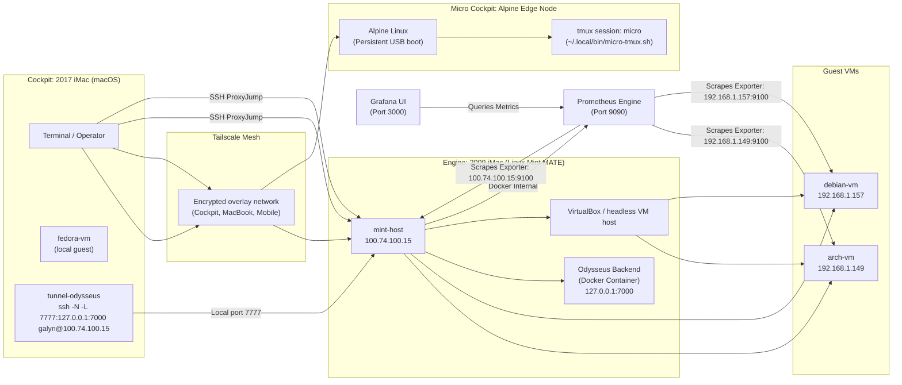

# Architecture Overview

This repository is the control plane and documentation source of truth for a multi-node homelab built around a macOS workstation, a Linux Mint virtualization host, an Alpine edge node, and multiple managed guest VMs. The layout favors direct SSH access, repeatable Ansible automation, Tailscale mesh networking, and terminal-native observability.

## System Overview

The environment spans three primary physical systems plus virtual guests:

| Role | Platform | Purpose |
| --- | --- | --- |
| **Cockpit** | 2017 iMac running macOS | Operator workstation, SSH client, tunnel origin, and day-to-day management surface |
| **Engine** | 2009 iMac running Linux Mint MATE | Hypervisor host, service runtime, local routing anchor, and primary compute hub |
| **Micro Cockpit** | Salvaged Inspiron 560 Dell tower running Alpine Linux | Physical edge node, persistent boot from 64GB USB (Ventoy deployment), headless automation anchor |

The Engine hosts the Linux virtualization layer and exposes managed guest systems:

| Guest | Address | Purpose |
| --- | --- | --- |
| **arch-vm** | `192.168.1.149` | Arch Linux guest for fast-moving or minimal service workloads |
| **debian-vm** | `192.168.1.157` | Debian guest for Debian-based workloads and package-compatibility testing |
| **fedora-vm** | `100.75.228.94` | Fedora guest running locally on Cockpit (2017 iMac) for DevOps workflows |

The Cockpit (2017 iMac) also hosts its own local fedora-vm for development and testing.

The repository treats this topology as a layered control system:

1. **Cockpit** (macOS) is where the operator works.
2. **Engine** (Mint) is the network and compute hub.
3. **Micro Cockpit** (Alpine) is the edge node for persistent remote operations.
4. **The VMs** are isolated workload targets accessed through their respective hosts.
5. **Shell scripts and Ansible** keep the topology reproducible.

## Network & Routing

The network path is built around a Tailscale-backed control plane and SSH-based hop routing.

### Tailscale mesh overlay

`mint-host` is defined in `ssh/config` with the Tailscale address `100.74.100.15`. That makes Mint the stable entry point for the Linux side of the lab, independent of local LAN changes.

The practical effect is:

- the macOS Cockpit can reach Mint over the encrypted Tailscale overlay,
- the operator's MacBook and mobile phone are fully joined onto the Tailscale mesh for remote control and access,
- Mint can act as a stable jump point into the RFC1918 VM subnet,
- the lab remains reachable without exposing guest services directly,
- remote clients maintain encrypted, authenticated paths to all managed nodes.

### SSH ProxyJump mechanics

The SSH config uses `ProxyJump mint-host` for both `arch-vm` and `debian-vm`.

That means:

1. the SSH client opens a connection to `mint-host`,
2. Mint relays the SSH session to the target VM,
3. the VM is reached without a separate direct trust path from Cockpit.

This keeps the VMs off the outer edge of the network while preserving a simple operator command surface:

```bash
ssh arch-vm
ssh debian-vm
```

### Service tunnel: `tunnel-odysseus`

The Odysseus backend has been migrated to a Docker container environment on the Engine (Mint host). `shell/aliases.sh` defines a named tunnel:

```bash
ssh -N -L 7777:127.0.0.1:7000 galyn@100.74.100.15
```

This creates a local-only forward on Cockpit:

- local port `7777` on macOS maps to
- Mint's loopback `127.0.0.1:7000`, where the Odysseus Docker container listens.

Local pipelines (such as the MCP server via stdio directory mapping) connect directly to this containerized backend, eliminating the need for loose Python runtimes or manual `python main.py` invocations. This is the cleanest route for exposing the backend without binding it publicly. The SSH session carries the traffic over the encrypted tunnel, and the containerized application remains bound to loopback on the Mint host.

## Infrastructure Automation

The `ansible/` directory documents a multi-OS automation layout for inventory, routing, and package management.

### Inventory

`ansible/hosts.yaml` separates hosts into OS-oriented groups:

- `arch_nodes` → `arch-vm`
- `debian_nodes` → `debian-vm`

Each host declares:

- its reachable IP address,
- the shared SSH user (`galyn`),
- and enough information for group-targeted tasks.

### Update orchestration

`ansible/playbook.yml` is a distro-aware update routine:

- Arch systems use `community.general.pacman`
- Debian systems use `ansible.builtin.apt`

The playbook branches on `ansible_os_family`, so the same run can safely target both guest types while preserving native package tooling.

### SSH key injection

`ansible/ssh_injection.yaml` standardizes access by installing the operator public key for `galyn` across managed endpoints using `ansible.builtin.authorized_key`.

This is important because it keeps access consistent across the lab and reduces manual per-host setup.

### Configuration boundary

`ansible/ansible.cfg` is the repository’s Ansible runtime anchor. Even when its contents stay minimal, the file marks the playbooks and inventory as part of a controlled, repeatable automation workflow rather than ad hoc terminal state.

## Local Shell Control Surface

The `shell/` directory provides operational shortcuts for lifecycle management and observability.

### VM lifecycle aliases

`shell/aliases.sh` exposes:

- `start-lab` to start the Arch and Debian VMs headlessly,
- `stop-lab` to request graceful shutdown,
- Docker management aliases to orchestrate the Odysseus backend container on port `7000`,
- `tunnel-odysseus` to expose that backend to Cockpit through SSH.

**Deprecated:** Loose Python runtimes and manual `python main.py` invocations are no longer used; the Odysseus backend runs exclusively as a containerized service.

### Session dashboards

The init scripts are terminal-native status surfaces:

- `shell/init/start_cockpit.sh` creates a tmux session for Cockpit-style system oversight.
- `shell/init/cybercockpit.sh` focuses on runtime observability with `journalctl`, `htop`, and `bmon`.
- `shell/init/debiancockpit.sh` emphasizes Docker operations with container, stats, and log panes.

### Automated tmux layer

The homelab uses automated tmux initialization to standardize session management across heterogeneous edge nodes:

**Alpine (Micro Cockpit):**

- Initialization triggered via login profile hooks in `~/.profile`
- Displays a custom welcome banner on shell startup
- Runs system statistics via `fastfetch` for real-time hardware monitoring
- References the layout script at `~/.local/bin/micro-tmux.sh`
- Hijacks the shell with `exec tmux` to launch a session named `"micro"`
- Ensures persistent, reproducible terminal state across reboots

**Fedora VM (DevOps workload):**

- Initialization triggered via `~/.bashrc` on interactive login
- Layout scripts located at `~/.local/bin/devops-tmux.sh`
- Replaces the shell with a tmux session named `"devops"`
- Provides a standardized DevOps-focused pane layout for development and testing

This approach ensures that any operator connecting to these nodes lands in a pre-configured, ready-to-work tmux session without requiring manual session creation.

### Shell bootstrap

`shell/bashrc_snippet.sh` wires the environment together by:

- presenting a branded terminal startup sequence,
- initializing `starship`,
- auto-launching tmux when appropriate,
- and sourcing the shared alias file.

## Local AI Runtime

`AI/Modelfile` defines a lightweight local model profile:

- base model: `llama3.2:1b`
- CPU threads: `2`

This suggests a constrained local inference setup intended for small, low-overhead tasks rather than high-throughput model serving.

## Repository Map

| Path | Responsibility |
| --- | --- |
| `README.md` | High-level project narrative and current lab summary |
| `docs/architecture.md` | Canonical architecture reference |
| `docs/linux-virtualization-security-socat.pdf` | Supporting research on virtualization and socket-based routing |
| `ansible/` | Inventory and configuration management |
| `ssh/` | SSH routing and jump-host definitions |
| `shell/` | Operator aliases, bootstrap hooks, and tmux dashboards |
| `AI/` | Local model configuration |

## Architecture Flow


### Telemetry & Observability Matrix

| Service | Port | Scope | Role |
| :--- | :--- | :--- | :--- |
| **Node Exporter** | `9100` | Global (All Nodes) | Pulls bare-metal and kernel hardware metrics |
| **Prometheus** | `9090` | Docker Container (Mint) | Time-series database scraping target endpoints every 15s |
| **Grafana** | `3000` | Docker Container (Mint) | Multi-node visualization dashboards (Dashboard UI ID: 1860) |

## Edge Node Operations

### Micro Cockpit (Alpine)

The Micro Cockpit is a salvaged Inspiron 560 Dell tower configured for headless remote automation:

- **OS:** Alpine Linux, minimal footprint suitable for persistent edge operations
- **Boot:** Entirely persistent off a 64GB USB drive using Ventoy deployment (survives hardware failures and enables rapid redeployment)
- **Access:** Joined to the Tailscale mesh overlay for reliable remote reach independent of LAN changes
- **Shell Initialization:** Login profile hook in `~/.profile` triggers:
  - Custom welcome banner display
  - System statistics via `fastfetch`
  - Auto-launch of `~/.local/bin/micro-tmux.sh` layout script
  - Shell hijack with `exec tmux` into a persistent session named `"micro"`
- **Operations:** Serves as a persistent automation anchor for long-running tasks, containerized workloads, and remote scripting that benefits from always-on availability

## Operational Notes

- The lab is designed around encrypted, named access paths rather than direct host exposure.
- All client devices (Cockpit, MacBook, mobile phone) are fully integrated into the Tailscale mesh overlay for seamless remote access.
- The Engine (Mint) and Micro Cockpit serve as dual compute anchors: Mint for primary virtualized services, Micro Cockpit for edge automation.
- The repository is most useful when treated as infrastructure-as-code plus operator ergonomics, not as a general-purpose application codebase.